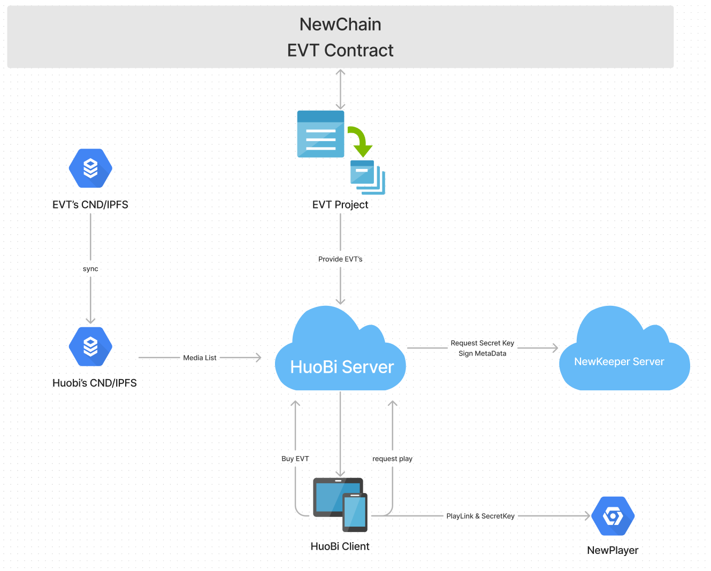

# 交易所 EVT 集成方案

## 一. 介绍

### 1. EVT是什么

EVT(Encrypted Variable Token) 是一个在元宇宙和现实世界可以替代NFT的新型token。

### 2. EVT vs NFT

<table>
  <tr>
    <td></td>
    <td>NFT</td>
    <td>EVT</td>
  </tr>
  <tr>
    <td>概念</td>
    <td>Non-FUngible Token</td>
    <td>Encrypted Variable Token</td>
  </tr>
  <tr>
    <td rowspan = 6>特性</td>
    <td>不可变，不可编程</td>
    <td>数据分为可变部分和不可变部分</td>
  </tr>
  <tr>
    <td>兼容 NRC7</td>
    <td>兼容 NRC7</td>
  </tr>
  <tr>
    <td>NFT中图片、视频、音频是公开的</td>
    <td>支持多种加密算法，包括AES, ECDSA, RSA, Lattice-Based加密算法等</td>
  </tr>
  <tr>
  	<td>/</td>
    <td>内建 metadata</td>
  </tr>
  <tr>
    <td>/</td>
    <td>开发工具</td>
  </tr>
  <tr>
    <td>/</td>
    <td>行业解决方案</td>
  </tr>
  <tr>
    <td>使用案例</td>
    <td>数字艺术品，例如：Cryptopunks, Bored Ape Yacht Club(BYAC)</td>
    <td>电影和音乐版权交易、流媒体、游戏、元宇宙、数字门票等</td>
  </tr>
</table>

### 3. 应用场景

我们设想的EVT应用场景有影视资产、隐私资产、数字身份。你可以设想出EVT更多的应用场景：

- 元宇宙 - 建筑、虚拟形象、鲜花、动物
- 物质资产 - 房屋、艺术品、电影、门票
- 负资产 - 借贷、负债和其他责任

## 二. 总体架构


总体架构介绍

L1: Newton区块链，EVT智能合约: 负责 EVT 的发行、转移、销毁等

L2: IPFS: 加密后的数据存储在IPFS上

L3: NewKeeper: 管理密钥，当收到用户密钥请求时，通过智能合约进行鉴权，返回密钥给用户

L4: SDK: 部署 EVT, 与 Newton 区块链交互

L5: NewPlayer 播放器、Wave客户端: 负责 EVT 播放

1、电影等资源经过切片加密后，上传到IPFS，经过加密通道，将加密密钥交给 NewKeeper, 同时在 Newton 上部署电影 EVT 合约

2、当用户购买 EVT 后，请求观看电影时，会发送密钥请求给 Newkeeper，Newkeeper 通过智能合约检查用户 EVT 合约地址，返回加密密钥给用户，用户通过 火必客户端、Wave客户端、NewPlayer 播放器等进行解密播放

## 二. 方案集成



- 流程图优化 @Minter
- `NewKeeper` 接入文档 @Alen
- `NewPlayer` 接入文档 @Pony, @James, @Ouli
- 解析 tokenUri demo @wangyifan
- 媒体资源格式说明文档,   @Alen, @Minter,
- 文档格式优化  @Jude, @Damon

### 1. 业务流程

#### EVT 合约发行

由 EVT-Core 联合资源方发行 EVT， 上传至 IPFS，同时创建 EVT Contact，由合作方同步资源信息至合作方 CDN。


#### Mint EVT

由 EVT-Core Mint 一定数量的 EVT 到交易所的 NEW 地址。


#### 维护 EVT 播放列表

由交易所维护 EVT 播放列表。


#### 用户购买 EVT

由交易所在平台购买 `EVT`,交易所服务中心化记账。


#### 用户播放 EVT

用户请求交易所服务器进行播放，先有交易所服务器鉴权，通过之后，交易所服务器到 `NewKeeper` 请求播放密钥,请求成功之后，
将密钥和播放链接返回交易所客户端，客户端将播放内容设置到 `NewPlayer` 进行播放观看。

### 2. 接入示例

- 如何解析EVT合约
  - 解析 tokenUri demo @wangyifan
  - 媒体资源格式说明文档,   @Alen, @Minter,

- `NewKeeper` 接入文档 @Alen
  - 步骤
  - Demo

## 三. NewKeepr API（具体API说明）


**请求地址**: `https://newkeeper.testnet.newtonproject.org/api/v1/evt/check/`

**请求参数**:

> 生成随机字符串作为  `message`,  使用 newton 钱包进行签名  ``


**header** 

| 名称          | 类型   | 说明                     |
| ------------- | ------ | ------------------------ |
| content-type  | string | application/json         |
| Authorization | string | 对 post 参数进行排序签名 |

#### params

| 参数             | 类型   | 说明                                             |
| ---------------- | ------ | ------------------------------------------------ |
| contract_address | string | EVT 合约地址                                     |
| sign_r           | string | 签名结果 r                                       |
| sign_s           | string | 签名结果 s                                       |
| sign_v           | string | 签名结果 v                                       |
| sign_message     | string | 使用`app_secret` 对 `message` 进行`aes` 加密结果 |
| app_key          | string | 申请访问 `newkeeper` 的 app_key                  |
| timestamp        | int    | 请求时间戳，单位秒                               |

#### response

| 参数        | 类型   | 说明                            |
| ----------- | ------ | ------------------------------- |
| csm_version | string | CSM 版本号                      |
| private_key | string | 用app_secret aes加密后的加密key |


Python 版代码示例

```python
import urllib
import base64
import datetime
from Crypto.Cipher import AES
from eth_account.messages import encode_defunct
from utils import newton_web3


# LIBS

'''
AES ENCRYPT
'''
# 
def add_to_16(value):
    while len(value) % 16 != 0:
        value += '\0'
    return str.encode(value)  # 返回bytes
# AES ENCRYPT
def aes_encrypt(key, text):
    aes = AES.new(add_to_16(key), AES.MODE_ECB)  # 初始化加密器
    encrypt_aes = aes.encrypt(add_to_16(text))  # 先进行aes加密
    encrypted_text = str(base64.encodebytes(encrypt_aes), encoding='utf-8')  # 执行加密并转码返回bytes
    return encrypted_text
# AES DECRYPT
def aes_decrypt(key, text):
    aes = AES.new(add_to_16(key), AES.MODE_ECB)  # 初始化加密器
    base64_decrypted = base64.decodebytes(text.encode(encoding='utf-8'))  # 优先逆向解密base64成bytes
    decrypted_text = str(aes.decrypt(base64_decrypted), encoding='utf-8').replace('\0', '')  # 执行解密密并转码返回str
    return decrypted_text

def sign_hmac(data, secret, prefix='', use_urlencode=False, joint='&'):
    data = collections.OrderedDict(sorted(data.items()))
    sign_string = prefix
    n = 0
    for k, v in data.items():
        if n != 0 and k != 'sign':
            sign_string += joint
        n += 1
        if k != 'sign':
            sign_string += u'%s=%s' % (k, v)
    sign_string += secret
    if use_urlencode:
        sign_string = urllib.quote_plus(sign_string)
    signed_string = generate_digest(sign_string)
    return signed_string
  
  


wallet_private_key = '0x...'
message = 'abcdefgjkqwerrttyuio' # 随机生成，不要纯数字，也不要十六进制字符串

w3 = newton_web3.get_web3()
signable_message = encode_defunct(text=message)
signed_message = w3.eth.account.sign_message(signable_message, private_key=wallet_private_key)

app_key = '...'
app_secret = '...'

data = {
    'contract_address': '0x...',
    'token_id': '111',
    'sign_r': hex(signed_message.r),
    'sign_s': hex(signed_message.s),
    'sign_v': signed_message.v,
    'sign_message': aes_encrypt(app_secret, message),
    'app_key': app_key,
    'timestamp': time.time(),
}

generate_sign = sign_hmac(data, app_secret)
headers = {
    'content-type': 'application/json',
    'Authorization': generate_sign,
}
api_url = 'https://newkeeper.testnet.newtonproject.org/api/v1/evt/check/'
response = requests.post(api_url, data=json.dumps(data), headers=headers)
result = json.loads(response.text)
if result['error_code'] == 1:
    csm_version = result['result']['csm_version']
    private_key = result['result']['private_key']
    private_key = aes_decrypt(app_secret, private_key)

```


## 四. NewPlayer SDK

- [Android-sdk & demo](https://gitlab.weinvent.org/wave/business/wave-websites/evt-player-android)
- [iOS-sdk & demo](https://gitlab.weinvent.org/wave/business/wave-websites/evt-player-ios)

## 五. EVT-lib

## 六. 更新记录

## 七. 引用

https://neps.newtonproject.org/neps/nep-53/

https://neps.newtonproject.org/neps/nep-7/