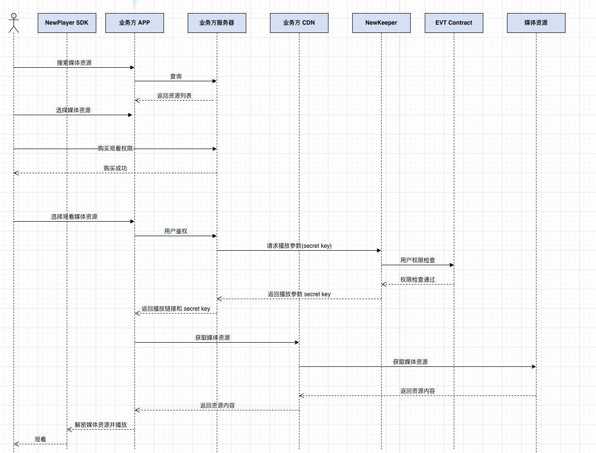

# EVT 集成

## 1. 介绍

### 1.1 EVT是什么
EVT是 Encrypted Variable Token的简称，EVT可以用于在元宇宙、数字出版、现实世界中加密可变资产发行。同时，EVT也定义了一套去中心化协议和架构。

### 1.2 EVT vs NFT

<table>
  <tr>
    <td></td>
    <td>NFT</td>
    <td>EVT</td>
  </tr>
  <tr>
    <td>概念</td>
    <td>Non-FUngible Token</td>
    <td>Encrypted Variable Token</td>
  </tr>
  <tr>
    <td rowspan = 4>特性</td>
    <td>不可变，不可编程</td>
    <td>数据分为可变部分和不可变部分</td>
  </tr>
  <tr>
    <td>NFT中图片、视频、音频是公开的</td>
    <td>支持多种加密算法，包括AES, ECDSA, RSA, Lattice-Based加密算法等</td>
  </tr>
  <tr>
    <td>/</td>
    <td>开发工具</td>
  </tr>
  <tr>
    <td>/</td>
    <td>行业解决方案</td>
  </tr>
  <tr>
    <td>使用案例</td>
    <td>数字艺术品，门票，例如：Cryptopunks, Bored Ape Yacht Club(BYAC)</td>
    <td>电影、音乐版权保护，私密文件、隐私数据交易，元宇宙人物、道具属性可升级</td>
  </tr>
</table>

### 1.3 应用场景
任何使用加密和可变内容的DApp都可以运用EVT标准和技术，典型的包括：
* 影视资产
* 隐私资产
* 数字身份
* ...

## 2. 总体架构

### 2.1 总体架构介绍

* L1: Newton区块链

  EVT智能合约，负责 EVT 的发行、转移、销毁等。

* L2: 去中心化存储

  加密后的数据存储在去中心化存储上。

* L3: NewKeeper

  去中心化密钥管理。当收到用户密钥请求时，通过智能合约进行鉴权，返回密钥给用户。

* L4: SDK

  EVT发行，与 Newton 区块链和NewKeeper进行交互。

* L5: 应用层

  应用集成EVT，例如 Metamask 购买 EVT，Wave客户端发行和交易EVT资产，huobi app交易EVT资产等。

### 2.2 EVT 工作流程
- 电影等资源经过切片加密后，上传到IPFS，发行方经过加密通道，将加密密钥交给 NewKeeper，同时在 Newton 上部署电影 EVT 合约。

- 当用户购买 EVT，请求观看电影时，会发送密钥请求给 Newkeeper，Newkeeper 通过智能合约检查用户是否持有 EVT，如果持有，返回加密密钥给用户，用户通过 火必客户端、Wave客户端、NewPlayer 播放器等进行解密播放。

## 3. 集成方案

### 3.1 业务流程

### 3.2 接入指南

1. 申请 gitlab 账号

   提供使用者邮箱，以便获取文档和客户端 SDK

2. 申请 NewKeeper 使用的 App_key 和 App_secret 

   提供申请信息和邮箱

3. 提供接收 EVT 到 NEW 钱包地址

   EVT-Core 铸造 EVT 到该地址，使地址具有从 NewKeeper 获取 SecretKey 的权限

4. 客户端下载 NewPlayer SDK 并集成到 APP

   - [Android SDK & demo](https://gitlab.weinvent.org/weinvent/incubator/evt-integration/evt-player-android)

   - [iOS SDK & demo](https://gitlab.weinvent.org/weinvent/incubator/evt-integration/evt-player-ios)

5. 服务器端完成 NewKeeper 授权

   - [NewKeeper API & demo](https://github.com/newtonproject/evt-integration-newkeeper)

### 3.3 媒体资源数据结构

- [媒体资源数据结构](https://gitlab.weinvent.org/weinvent/incubator/evt-integration/evt-solution-docs/-/blob/master/exchange/tokenUri.md)

### 3.4 现有EVT方案的通用性和局限性

- 通用性

  现有EVT方案为原创作者、内容运营机构提供了完善的版权保护和变现的通用解决方案。

- 局限性

  NewPlayer 目前只支持 Android 和 iOS 端，未来会增加对 Web 端的支持。

## 4. 更新记录

- v1.0 2022-12-07

  初始文档

## 5. 引用

1. https://neps.newtonproject.org/neps/nep-53/

2. https://neps.newtonproject.org/neps/nep-7/

3. https://www.newtonproject.org/en/evt/
