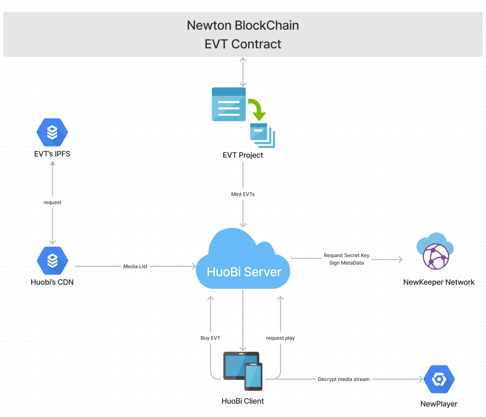

# EVT 集成

## 一. 介绍

### 1. EVT是什么

EVT(Encrypted Variable Token) 是一个在元宇宙和现实世界可以替代NFT的新型token。

### 2. EVT vs NFT

<table>
  <tr>
    <td></td>
    <td>NFT</td>
    <td>EVT</td>
  </tr>
  <tr>
    <td>概念</td>
    <td>Non-FUngible Token</td>
    <td>Encrypted Variable Token</td>
  </tr>
  <tr>
    <td rowspan = 4>特性</td>
    <td>不可变，不可编程</td>
    <td>数据分为可变部分和不可变部分</td>
  </tr>
  <tr>
    <td>NFT中图片、视频、音频是公开的</td>
    <td>支持多种加密算法，包括AES, ECDSA, RSA, Lattice-Based加密算法等</td>
  </tr>
  <tr>
    <td>/</td>
    <td>开发工具</td>
  </tr>
  <tr>
    <td>/</td>
    <td>行业解决方案</td>
  </tr>
  <tr>
    <td>使用案例</td>
    <td>数字艺术品，门票，例如：Cryptopunks, Bored Ape Yacht Club(BYAC)</td>
    <td>电影、音乐版权保护，私密文件、隐私数据交易，元宇宙人物、道具属性可升级</td>
  </tr>
</table>

### 3. 应用场景

我们设想的EVT应用场景有影视资产、隐私资产、数字身份。你可以设想出EVT更多的应用场景：

- 元宇宙 - 建筑、虚拟形象、鲜花、动物
- 物质资产 - 房屋、艺术品、电影、门票
- 负资产 - 借贷、负债和其他责任

## 二. 总体架构

### 总体架构介绍

L1: Newton区块链，EVT智能合约，负责 EVT 的发行、转移、销毁等

L2: 去中心化存储，加密后的数据存储在去中心化存储上，例如IPFS

L3: NewKeeper，管理密钥，当收到用户密钥请求时，通过智能合约进行鉴权，返回密钥给用户

L4: SDK，部署 EVT，与 Newton 区块链交互

L5: 应用层，第三方集成EVT，例如 Metamask 购买 EVT，Wave客户端发行，NewPlayer 播放器等

### EVT 工作流程
#### 概述

1、电影等资源经过切片加密后, 上传到IPFS，发行方经过加密通道，将加密密钥交给 NewKeeper, 同时在 Newton 上部署电影 EVT 合约

2、当用户购买 EVT，请求观看电影时，会发送密钥请求给 Newkeeper，Newkeeper 通过智能合约检查用户是否持有 EVT，如果有，返回加密密钥给用户，用户通过 火必客户端、Wave客户端、NewPlayer 播放器等进行解密播放

#### EVT 合约发行

由 EVT-Core 联合资源方发行 EVT， 上传至 IPFS，同时创建 EVT Contact，由合作方同步资源信息至合作方 CDN。

#### Mint EVT

由 EVT-Core Mint EVT 到交易所的 NEW 地址。

#### 维护 EVT 播放列表

由交易所维护 EVT 播放列表。

#### 用户购买观看权限

由交易所在平台购买 `EVT`,交易所服务中心化记账。

#### 用户播放 EVT

用户请求交易所服务器进行播放，先有交易所服务器鉴权，通过之后，交易所服务器到 `NewKeeper` 请求播放密钥,请求成功之后，
将密钥和播放链接返回交易所客户端，客户端将播放内容设置到 `NewPlayer` 进行播放观看。

## 二. 方案集成

### 1. 业务流程

### 2. 接入指南

#### 2.1 客户端集成 NewPlayer SDK

- [Android-sdk & demo](https://gitlab.weinvent.org/wave/business/wave-websites/evt-player-android)
- [iOS-sdk & demo](https://gitlab.weinvent.org/wave/business/wave-websites/evt-player-ios)

#### 2.2 服务端接入 `NewKeeper`

[NewKeeper API](newkeeper-api.md)

#### 2.3 相关文档

[Token Uri](tokenUri.md)

## 三. EVT Specs

[EVT Specs](evt-specs.md)

## 四. 更新记录

## 五. 引用

https://neps.newtonproject.org/neps/nep-53/

https://neps.newtonproject.org/neps/nep-7/
